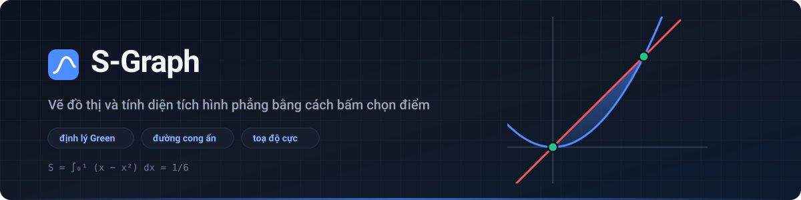

<div align="center">



# S-Graph

**Vẽ đồ thị hàm số và tính diện tích hình phẳng bằng cách bấm chọn điểm ngay trên đồ thị.**

[](https://github.com/fortress07/project_S-Graph/actions/workflows/ci.yml)
[](LICENSE)
[](#chạy-thử)

</div>

## Dự án làm gì

Bài toán "tính diện tích hình phẳng giới hạn bởi các đường…" xuất hiện dày đặc trong chương trình giải tích phổ thông. S-Graph biến nó thành thao tác trực quan: nhập các đường biên, bấm chọn những điểm bao quanh vùng, rồi nhận ngay diện tích kèm công thức tích phân.

Người dùng chỉ đánh dấu vài **đỉnh**. Việc suy ra cạnh nào của vùng nằm trên đường cong nào là do chương trình tự phân tích.

## Vẽ được những gì

| Loại | Ví dụ |
|---|---|
| Hàm số | `y = x^2 - 2x` |
| Hàm theo y, đường thẳng đứng | `x = y^2`, `x = 2` |
| Đường cong ẩn (tròn, elip, hypebol…) | `x^2 + y^2 = 25` |
| Toạ độ cực | `r = 3cos(2θ)` |
| Đường tham số, điểm | `(cos t, sin t)`, `(2, 3)` |
| Miền nghiệm bất phương trình | `y < x^2` |
| Giới hạn miền xác định | `y = x^2 {0 < x < 3}` |

## Tính diện tích

* Chọn các đỉnh, chương trình tự tìm chu trình khép kín đi theo đúng các đường cong.
* Đúng với cả vùng lõm và vùng có nhiều đường biên khác nhau.
* Trục Ox, Oy luôn là đường biên hợp lệ (không cần nhập thêm `y = 0`).
* Bấm thẳng lên đường cong để thêm đỉnh ở vị trí tuỳ ý, lấy cận tích phân bất kỳ.
* Kết quả hiện cả dạng đẹp: `1/6`, `9π`, `16/3`.
* Liệt kê các đường tạo nên biên và dựng công thức `S = ∫ₐᵇ |f − g| dx` khi vùng đủ đơn giản.

Giao diện sáng/tối, bàn phím toán học ảo, lưu phiên tự động, liên kết chia sẻ, xuất ảnh PNG, dùng được trên điện thoại.

## Chạy thử

Trang tĩnh thuần, không cần bước dựng, không cần cài gói nào.

```bash
git clone https://github.com/fortress07/project_S-Graph.git
cd project_S-Graph
npm start     # mở http://localhost:8080
npm test      # 55 phép thử cho lõi tính toán
```

> [!NOTE]
> Mã nguồn dùng ES module nên trình duyệt chặn khi mở trực tiếp bằng `file://`.
> Hãy chạy qua máy chủ cục bộ như trên, hoặc triển khai lên GitHub Pages.

Kiểm thử giao diện chạy trong trình duyệt: mở `tests/ui-check.html`.

## Cú pháp

Ô nhập dùng [MathQuill](http://mathquill.com/), gõ được như viết tay; bàn phím ảo có sẵn mọi ký hiệu.

```
+ − × ÷ ^ !   (x+1)(x−2)   2x   3π   |x|   ⌊x⌋   n!   30°   ∞
√x   ∛x   ⁿ√x   phân số lồng nhau bao nhiêu tầng cũng được
sin cos tan cot sec csc, hàm ngược (sin⁻¹), hyperbolic
ln x, log x (cơ số 10), log₂ x
```

Vài quy ước:

* `log` là logarit cơ số 10, `ln` là logarit tự nhiên (theo chương trình phổ thông Việt Nam).
* Hàm không ngoặc gom đối số theo lối viết tay: `sin 2x` → `sin(2x)`, còn `sin x cos x` → `sin(x)·cos(x)`.
* Ngoài tập xác định thì nét vẽ đứt đúng chỗ, không trả về số phức.

## Cách hoạt động

**Đọc biểu thức.** LaTeX đi qua bộ tách token và bộ phân tích cú pháp Pratt, rồi biên dịch thành closure JavaScript (không dùng `eval`). Nhờ đọc nhóm `{…}` theo đúng độ sâu, biểu thức lồng nhau như `\frac{x^{2}}{3}` cho kết quả chính xác.

**Một giao diện chung cho mọi đường cong.** Hàm số, hàm theo y, đường ẩn, đường cực và đường tham số đều cài đặt cùng bốn phương thức: lấy mẫu thành nhánh, hàm dư `F(x, y)`, toạ độ theo tham số, và tích phân trên cung. Nhờ vậy bộ tìm giao điểm cùng bộ tính diện tích chỉ cần viết một lần.

**Tìm giao điểm.** Cắt đoạn trên đường gấp khúc để có vị trí gần đúng, rồi lặp Newton hai chiều trên cặp hàm dư để đưa về độ chính xác cỡ sai số máy.

**Suy luận vùng.** Các đỉnh được chọn nối thành cung *có thật* trên đường cong, sau đó tìm chu trình đi qua đúng một lần mỗi đỉnh (ưu tiên ít cung phụ nhất, không tự cắt, chu vi nhỏ nhất). Diện tích tính bằng định lý Green `S = |∮ −y dx|`, mỗi loại cung dùng công thức riêng.

Sai số thực đo được: `1e-12` với hàm số, `1e-10` với đường ẩn, cực và tham số.

## Kiến trúc

```
src/
├── core/     toán học thuần, không đụng DOM, chạy được trên Node
│             latex, parser, compile, analyze, curve, numeric, features, region
├── ui/       canvas, khung nhìn, tương tác, bàn phím, danh sách hàm, kết quả
├── styles/   biến thiết kế, bố cục, bàn phím
└── main.js   ghép mọi thứ lại
```

Phụ thuộc ngoài chỉ có MathQuill và jQuery (MathQuill cần), nạp từ CDN kèm mã băm SRI. Mất mạng thì ứng dụng tự chuyển sang ô nhập văn bản và vẫn dùng được đầy đủ.

## An toàn

Liên kết chia sẻ mang theo trạng thái do người khác tạo, nên được coi là dữ liệu không đáng tin:

* LaTeX được lọc theo danh sách lệnh cho phép trước khi giao cho MathQuill dựng DOM.
* Màu chỉ nhận mã hex, chặn việc nhét `url(...)` để dò địa chỉ IP người mở.
* Khung nhìn bị kẹp về khoảng an toàn, tránh làm treo thẻ trình duyệt.
* Trang khai báo Content-Security-Policy nghiêm ngặt, chặn cả script nội tuyến lẫn kết nối ra ngoài.

## Giấy phép

[MIT](LICENSE)
